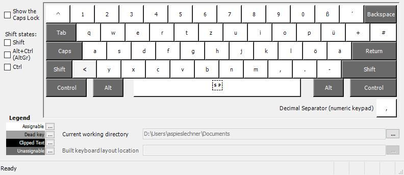
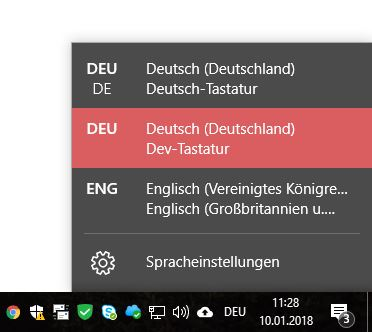

# German QWERTZ Layout for Developers

Removes deadlock functionality from ` and ^ keys    
> You'll no longer have to hit those keys twice to render them.    
  *This is especially useful for developers who constantly have to use backticks while writing code*

All other keys are unchanged

## Install

1. Clone, or download the package
2. Execute `./install/setup.exe`
3. Restart your machine

You should now have the Dev-Keyboard available. No need to change anything in the Region & Language settings.

### Notes

This keyboard layout was created with the official microsoft keyboard layout creator.

You can download the software from here to create your own: [https://www.microsoft.com/en-us/download/details.aspx?id=22339](https://www.microsoft.com/en-us/download/details.aspx?id=22339)

